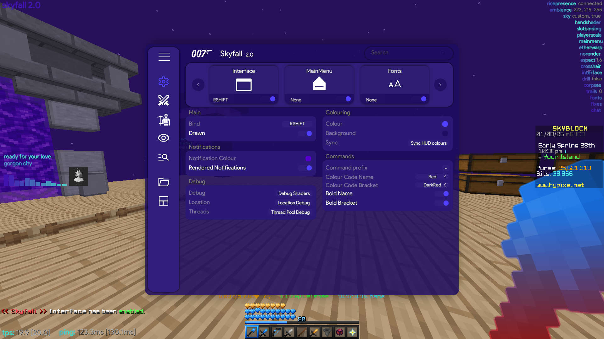

# Skyfall

Skyfall is a deprecated Forge 1.8.9 Hypixel SkyBlock mod focused on polished visuals, practical QoL, and a fast custom client framework.

## Information
Built by lyric (with contributions from turtle and eva), this project is a full client architecture with reusable systems for features, HUD modules, rendering, config, and threading, designed to be easy to use and understand, while still being performant.
Originally designed as a learning experience for me, which then became a lesson in client bases for others to develop off of, and then following some departures, my own personal project to work on niche features I thought would be nice for myself.
The client is well optimised for its feature base - with a full custom thread system, and is ruthlessly optimised for rendering based on its memory usage, and CPU execution time benchmarks.
Skyfall still contains a few outdated and bad systems (Command system etc) that were planned to be rewritten properly but made redundant as Hypixel forced 1.21.5+ versions.

## Shaders
The client is built with shader systems in mind, from their use in the 2D text rendering (gradient text shading) to 3D shading (HandShaders) to use in the Minecraft main menu (MainMenu feature) to their use in the UI.
However, due to the absolutely ancient OpenGL version that this version of Minecraft uses, these are archaic and badly coded systems, but the best that can be done as far as the limited featureset of these old OpenGL versions.
This in particular effects the gradient mode HandShaders, which are quite buggy at capturing in-game held item bounds.

## UI
The client's UI is zPrestige's formerly private Mud 1.12 ported to 1.8.9, and rewritten to fix many of its issues, and vastly improved with scroll capping, automatic colour offsets, and far more customisability.
The UI utilises a custom shader system vastly improved from the original to use Blur and Shadowing inside it, supporting its colour offsets and animations (it has a lot of those).

## Spotify/Tidal visualiser notes
Skyfall features a very user-friendly, live and accurate Spotify/Tidal visualiser, which utilises threading to capture loopback system audio, then visualise it, without the need of any included API. 
However, to prevent misuse, the API that looks up album covers has had Skyfall's internal keys removed. 
All that you need to do to make this functional, is simply create your own Spotify API account, which is easy, free and doesn't require a mod side dependency. 
If the user does not have a loopback device, the Spotify visualiser attemps to lookup the song's BPM using another web API to match its simulation to. The user can also set the BPM manually using a setting.

## Former contents and credits
Previously contained many dungeon related features, and a custom pathfinder, and others who used the base to develop QOL features for private use. These systems and the features that utilised them were since removed and the client vastly rebased to reflect this.
Credit to eva, 1mi0 and turtleonfire2 for these additions
Credit to zPrestige for the original Mud UI concept
Credit to serenity for the name of our @annotation for the event system
Credit to shadertoy.com for GLSL shader files relating to the main menu shader system